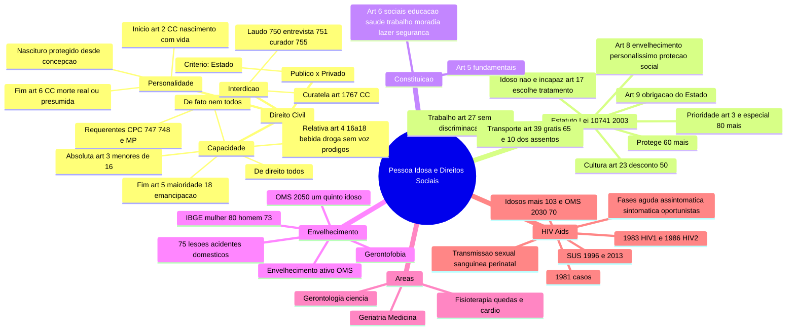
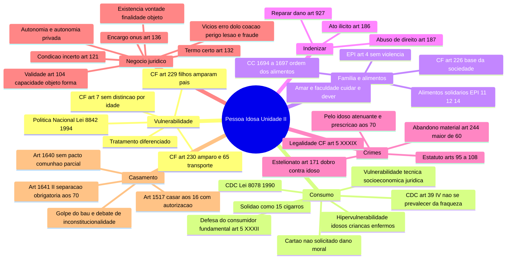

# Mapa mental: A Pessoa Idosa e os Direitos Sociais (Unidade I)

Cole este código em qualquer visualizador de Mermaid (por exemplo o preview de Markdown do
VS Code, ou mermaid.live) para ver o mapa.

## Unidade II

